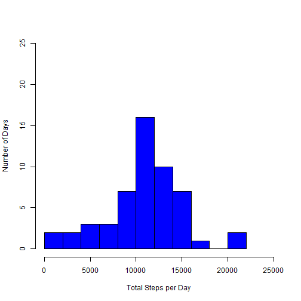
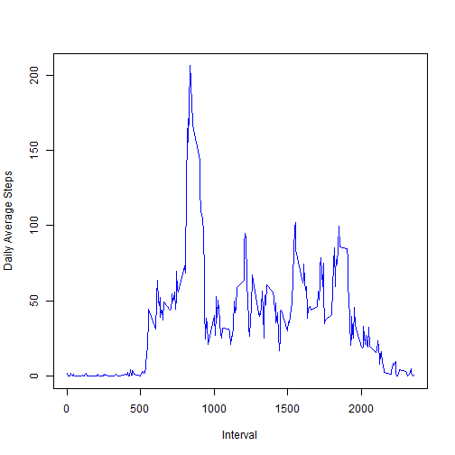
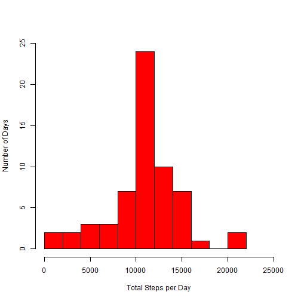
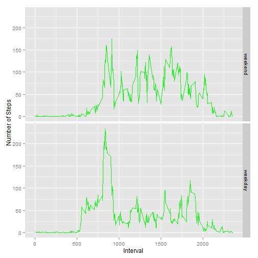

Supplemental packages must be loaded.


```r
library(dplyr)
library(lubridate)
library(ggplot2)
```

## Loading and preprocessing the data

The contents of the [*zipped personal activity dataset*](https://d396qusza40orc.cloudfront.net/repdata%2Fdata%2Factivity.zip) are read into a data frame called *activity*. The dataset is assumed to reside in the current working directory. The **date** field is then reformatted as POSIXct, and I examine the structure and contents of the data frame.


```r
activity <- read.csv(unzip("activity.zip"), stringsAsFactors=FALSE)
activity$date <- ymd(activity$date)

str(activity)
```

```
## 'data.frame':	17568 obs. of  3 variables:
##  $ steps   : int  NA NA NA NA NA NA NA NA NA NA ...
##  $ date    : POSIXct, format: "2012-10-01" "2012-10-01" ...
##  $ interval: int  0 5 10 15 20 25 30 35 40 45 ...
```

```r
head(activity)
```

```
##   steps       date interval
## 1    NA 2012-10-01        0
## 2    NA 2012-10-01        5
## 3    NA 2012-10-01       10
## 4    NA 2012-10-01       15
## 5    NA 2012-10-01       20
## 6    NA 2012-10-01       25
```

## What is mean total number of steps taken per day?

First, I calculate the total number of steps taken by the subject in each day, store the result in a data frame called *act_sum*, and print the first few lines. Note that some days contain only NA values.


```r
act_sum <- activity %>%
           group_by(date) %>%
           summarize(totalsteps=sum(steps))
act_sum
```

```
## Source: local data frame [61 x 2]
## 
##          date totalsteps
##        (time)      (int)
## 1  2012-10-01         NA
## 2  2012-10-02        126
## 3  2012-10-03      11352
## 4  2012-10-04      12116
## 5  2012-10-05      13294
## 6  2012-10-06      15420
## 7  2012-10-07      11015
## 8  2012-10-08         NA
## 9  2012-10-09      12811
## 10 2012-10-10       9900
## ..        ...        ...
```

Then I generate a histogram showing how the sample is distributed by total number of steps taken per day. NA values are ignored.


```r
hist(act_sum$totalsteps,
     breaks=10,
     xlim=c(0,25000),
     ylim=c(0,25),
     main="",
     col="blue",
     xlab="Total Steps per Day",
     ylab="Number of Days"
    )
```



Finally, I calculate and store the mean and median number of steps taken per day, again ignoring the NA values (i.e., excluding them rather than treating them as zeroes).


```r
mean_steps = mean(act_sum$totalsteps, na.rm=TRUE)
median_steps = median(act_sum$totalsteps, na.rm=TRUE)
```

The mean daily number of steps is **10,766.19**  
The median daily number of steps is **10,765**

## What is the average daily activity pattern?

First, I calculate the average number of steps taken within each five-minute time interval across days in the sample.


```r
act_pat <- activity %>%
           group_by(interval) %>%
           summarize(meansteps=mean(steps,na.rm=TRUE))
head(act_pat)
```

```
## Source: local data frame [6 x 2]
## 
##   interval meansteps
##      (int)     (dbl)
## 1        0 1.7169811
## 2        5 0.3396226
## 3       10 0.1320755
## 4       15 0.1509434
## 5       20 0.0754717
## 6       25 2.0943396
```

Next, I generate a time-series plot showing how the average number of steps changes throughout the day.


```r
with(act_pat,
     plot(interval, meansteps,
          type="l",
          col=c("blue"),
          main="",
          xlab="Interval",
          ylab="Daily Average Steps"
         )
    )
```



Finally, I find the interval with the highest average daily steps.


```r
maxint <- act_pat[which(act_pat$meansteps==max(act_pat$meansteps)),]$interval
```

The interval labelled **835** has the highest average step count.

## Imputing missing values


```r
nmiss <- nrow(activity[is.na(activity$steps),])
```

The *activity* dataset contains **2,304** observations with missing step counts.

I will replace missing values with the mean value for the corresponding interval and store the result in a dataset called *act_fix*.


```r
act_fix <- activity %>%
           left_join(act_pat, by="interval") %>%
           mutate(steps = ifelse(is.na(steps), meansteps, steps)) %>%
           select(-meansteps)
head(act_fix)
```

```
##       steps       date interval
## 1 1.7169811 2012-10-01        0
## 2 0.3396226 2012-10-01        5
## 3 0.1320755 2012-10-01       10
## 4 0.1509434 2012-10-01       15
## 5 0.0754717 2012-10-01       20
## 6 2.0943396 2012-10-01       25
```

```r
nmiss <- nrow(act_fix[is.na(act_fix$steps),])
```
The *act_fix* dataset contains **0** missing observations.

Now I generate a histogram showing how the sample is distributed by the total number of steps taken per day, after imputation.


```r
act_fix_sum <- act_fix %>%
               group_by(date) %>%
               summarize(totalsteps=sum(steps))
act_fix_sum
```

```
## Source: local data frame [61 x 2]
## 
##          date totalsteps
##        (time)      (dbl)
## 1  2012-10-01   10766.19
## 2  2012-10-02     126.00
## 3  2012-10-03   11352.00
## 4  2012-10-04   12116.00
## 5  2012-10-05   13294.00
## 6  2012-10-06   15420.00
## 7  2012-10-07   11015.00
## 8  2012-10-08   10766.19
## 9  2012-10-09   12811.00
## 10 2012-10-10    9900.00
## ..        ...        ...
```

```r
hist(act_fix_sum$totalsteps,
     breaks=10,
     xlim=c(0,25000),
     ylim=c(0,25),
     main="",
     col="red",
     xlab="Total Steps per Day",
     ylab="Number of Days"
    )
```



Finally, I calculate and store the mean and median number of steps taken per day.


```r
mean_fix_steps = mean(act_fix_sum$totalsteps)
median_fix_steps = median(act_fix_sum$totalsteps)
```

The mean daily number of steps after imputation is **10,766.19**  
The median daily number of steps after imputation is **10,766**

The mean and median remain unchanged as a result of my method of imputation. This is due to the fact that all missing values corresponded to days without any observations.  In effect, I added a handful of new data points at the mean, which had no effect on the result of either calculation.

## Are there differences in activity patterns between weekdays and weekends?

First I create a new factor variable called *daytype* which identifies date values as either weekday or weekend days.  I then calculate mean daily step counts for each interval and day type and store the result in a new *act_pat* dataset.


```r
activity$daytype <- factor(ifelse(weekdays(activity$date, abbreviate=TRUE) %in% c("Sat","Sun"), 1, 2), labels=c("weekend", "weekday"))
table(activity$daytype)
```

```
## 
## weekend weekday 
##    4608   12960
```

```r
act_pat <- activity %>%
           group_by(daytype, interval) %>%
           summarize(meansteps=mean(steps,na.rm=TRUE))
head(act_pat)
```

```
## Source: local data frame [6 x 3]
## Groups: daytype [1]
## 
##   daytype interval meansteps
##    (fctr)    (int)     (dbl)
## 1 weekend        0  0.000000
## 2 weekend        5  0.000000
## 3 weekend       10  0.000000
## 4 weekend       15  0.000000
## 5 weekend       20  0.000000
## 6 weekend       25  3.714286
```

Now I use the new variable to construct a panel plot enabling comparison of weekend and weekday average daily step patterns.


```r
ggplot(data=act_pat, aes(x=interval, y=meansteps)) +
  geom_line(color="green") +
  facet_grid(daytype~.) + 
  xlab("Interval") +
  ylab("Number of Steps") +
  theme_grey()
```



Certain differences are evident between weekend days and weekdays.  The peak at interval **835** appears in the weekday series but does not appear on weekends.  Weekend activity begins and ends later and tends to remain at a higher sustained level throughout the active portion of the day.
